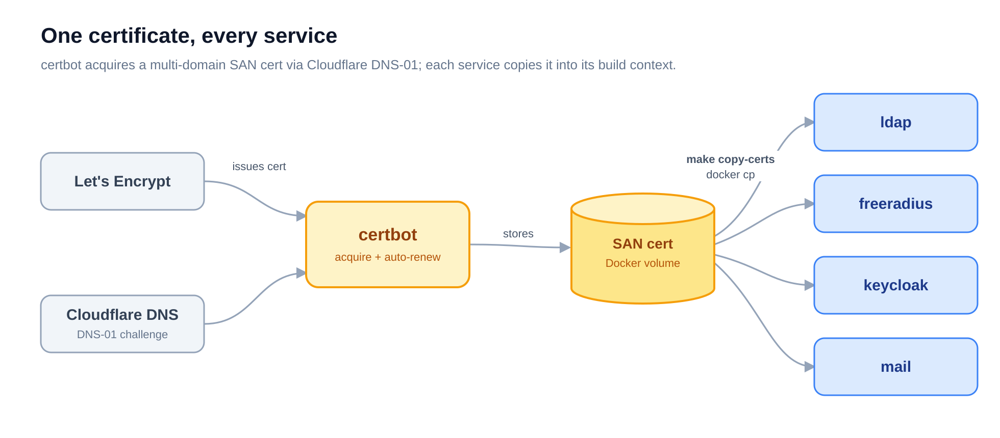
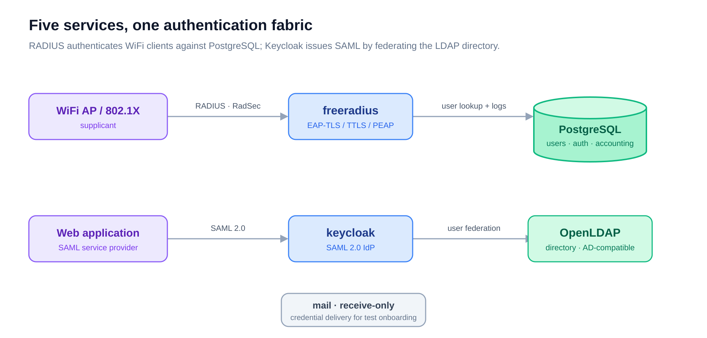
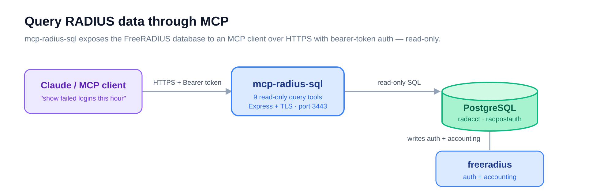

# Enterprise Authentication Testing Platform

A self-hosted lab for testing enterprise WiFi and SSO authentication end to end —
LDAP, RADIUS, and SAML on real TLS certificates, run as independent Docker services.


## What it is

Standing up an authentication backend to test a WiFi access point, an 802.1X
supplicant, or a SAML web app usually means wiring together a directory, a RADIUS
server, an identity provider, and the certificates that tie them together. This
repository packages all of that as six independent Docker sub-projects you drive with
`make` — deploy the whole stack, or just the piece you need.

Every service runs on genuine Let's Encrypt certificates, so TLS behaves exactly as it
would in production: EAP-TLS, RadSec, LDAPS, and SAML-over-HTTPS all negotiate against
real trust chains, not self-signed stand-ins.

## How it works

**The key idea: six sub-projects, one shared certificate lifecycle.** That shared
certificate is the spine that lets the services stay independent yet trust each other.
A single `certbot` project acquires one multi-domain (SAN) certificate through the
Let's Encrypt **DNS-01 challenge via Cloudflare** — no public port 80 required — and
keeps it renewed in a Docker volume. Each service then copies that certificate into its
own build context with `make copy-certs` (a `docker cp` out of the certbot container),
so certificates live in the image at build time rather than being mounted at runtime.



Add a new TLS service by pointing its `copy-certs` script at the same volume — the
certificate strategy scales without a second certbot.

### The services compose into one authentication fabric

With certificates in place, the services exercise the flows you actually want to test.
FreeRADIUS authenticates WiFi clients against a PostgreSQL user store and logs every
attempt; Keycloak federates the OpenLDAP directory to issue SAML assertions for web
apps; the mail server receives the credential emails a real onboarding flow would send.



### RADIUS data is queryable through MCP

`mcp-radius-sql` exposes the FreeRADIUS PostgreSQL data — auth attempts, accounting
sessions, active connections — as an **MCP server** over HTTPS with bearer-token auth.
Point Claude (or any MCP client) at it and ask "show me failed logins in the last hour"
in plain language; every query is read-only and parameterized.



## Components

| Sub-project | Role | Stack | Ports |
|-------------|------|-------|-------|
| [`certbot/`](certbot/README.md) | Shared certificate management | Certbot + Cloudflare DNS-01 | — (DNS challenge) |
| [`ldap/`](ldap/README.md) | Directory authentication | OpenLDAP, AD-compatible schema | 389, 636 |
| [`freeradius/`](freeradius/README.md) | RADIUS authentication + accounting | FreeRADIUS 3.x, PostgreSQL | 1812–1813/udp, 2083/tcp |
| [`keycloak/`](keycloak/README.md) | SAML 2.0 identity provider | Keycloak, LDAP federation | 8080, 8443 |
| [`mail/`](mail/README.md) | Receive-only mail server | Postfix / Dovecot | 25, 993 |
| [`mcp-radius-sql/`](mcp-radius-sql/README.md) | RADIUS data over MCP | Node.js, Express + TLS | 3443 |

## Quickstart

> **Prerequisites:** Linux host with Docker and Docker Compose v2, a domain you control
> on Cloudflare DNS, and a Cloudflare API token for the DNS-01 challenge. Each project
> has its own `.env` — run `make env` to scaffold it from `.env.example`.

Deploy in dependency order; the certificate foundation comes first.

```bash
# 1. Certificate foundation — acquire the shared SAN certificate
cd certbot
make env                              # configure DOMAINS, email, Cloudflare creds
make deploy

# 2. LDAP directory + test users
cd ../ldap
make init                             # copy-certs → build-tls → deploy
make setup-users

# 3. RADIUS authentication
cd ../freeradius
make init                             # copy-certs → build → deploy → smoke test

# 4. SAML identity provider (optional)
cd ../keycloak
make init                             # copy-certs → deploy → smoke test
make setup-realm                      # configure the SAML realm

# 5. Mail server (optional)
cd ../mail
make deploy

# 6. RADIUS-over-MCP server (optional)
cd ../mcp-radius-sql
make deploy
```

Every project shares the same operational verbs: `make deploy`, `make stop`,
`make logs`, `make clean`. See each sub-project's README for its full target list.

### Verify it works

```bash
cd freeradius
make test            # basic RADIUS authentication
make test-users      # every configured test user
make test-tls        # RadSec (RADIUS over TLS)
```

### Test users

The same five users exist across LDAP and RADIUS, so you can test either path with one
credential set (passwords are set from each project's `.env`).

| Username | Role | Notes |
|----------|------|-------|
| `test` | Basic user | — |
| `guest` | Limited access | Session timeout via group |
| `admin` | Administrator | — |
| `contractor` | Time-limited | Session timeout via group |
| `vip` | Priority user | — |

## Use cases

- **WiFi / 802.1X testing** — validate AP configs against a real EAP-TLS / PEAP / TTLS backend
- **SAML SSO integration** — test web-app login against a standards-compliant IdP
- **Network access control** — exercise NAC systems that expect LDAP and RADIUS
- **Pre-production validation** — rehearse auth flows and TLS configs before going live

## Documentation

- [Architecture](docs/03-ARCHITECTURE.md) — the multi-project layout and certificate strategy
- [Features](docs/04-FEATURES.md) — capability matrix per service
- [SQL auth design](docs/05-SQL-AUTH-DESIGN.md) — why RADIUS users live in PostgreSQL, and the MCP tools that manage them
- [Product requirements](docs/02-PRD.md) · [Brainstorming notes](docs/01-brainstorming-session-results.md) — background and rationale
- RADIUS deep dives live in [`freeradius/docs/`](freeradius/docs/)
- Diagram sources: [`docs/images/`](docs/images/) (`*.svg`; re-render the PNGs with `docs/images/render.sh`)

## License

Released under the MIT License.
