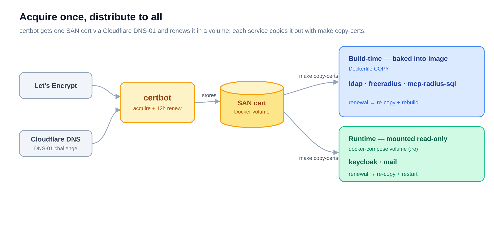

# certbot — the certificate hub

> Part of the [Enterprise Authentication Testing Platform](../README.md). Deploy this
> **first** — every other service builds its TLS on the certificate this one acquires.

## What it is

A minimal certbot container that acquires **one multi-domain (SAN) certificate** from
Let's Encrypt and keeps it renewed in a Docker volume. The other five services don't each
talk to Let's Encrypt — they copy this certificate out with `make copy-certs`. It validates
with the **Cloudflare DNS-01 challenge**, so no inbound port (80/443) is needed, which is
why it works for services that never expose HTTP.

## How it works



- **Acquire:** `certbot certonly --dns-cloudflare` writes an `_acme-challenge` TXT record
  through the Cloudflare API, waits for DNS propagation, and Let's Encrypt validates it.
- **Store + renew:** the certificate lands in the `certificates` Docker volume at
  `/etc/letsencrypt/live/<first-domain>/`; the container loops `certbot renew` every 12
  hours (Let's Encrypt only re-issues within 30 days of expiry, so most runs are no-ops).
- **Distribute:** each service runs `make copy-certs` to pull the cert out of the running
  container. Three services **bake it into their image at build** (`ldap`, `freeradius`,
  `mcp-radius-sql`); two **mount it read-only at runtime** (`keycloak`, `mail`). That split
  decides whether a renewal needs a rebuild or just a restart.

## Quickstart

```bash
make env          # create .env, then edit DOMAINS / LETSENCRYPT_EMAIL / STAGING
# create cloudflare.ini next to this README (see Configuration) — it is gitignored
make deploy       # acquire the SAN certificate, then renew every 12h
make logs         # watch for "Successfully received certificate"
```

`make` targets: `env`, `deploy`, `stop`, `logs`, `clean`. **`clean` runs `docker compose
down -v` — it removes the volume and deletes the certificate.**

## Configuration

`.env` (from `.env.example`):

| Variable | Default | Purpose |
|----------|---------|---------|
| `DOMAINS` | `ldap.example.com,radius.example.com` | Comma-separated names on the SAN certificate. The **first** name is the volume's live-directory name that services point `copy-certs` at. |
| `LETSENCRYPT_EMAIL` | `admin@example.com` | Account / expiry-notice email |
| `STAGING` | `true` | `true` = Let's Encrypt **staging** (untrusted test certs, high rate limit). Set `false` for real certificates. |
| `DRY_RUN` | `false` | `true` = simulate issuance (validate Cloudflare creds + DNS without issuing) |

**`cloudflare.ini`** — you create it (gitignored); mounted read-only at
`/etc/cloudflare/cloudflare.ini`. Use a Cloudflare API token scoped to **Zone › DNS ›
Edit** for your domain:

```ini
dns_cloudflare_api_token = <your-cloudflare-api-token>
```

## How services consume the certificate

Each sibling copies the cert from the running container, then either builds or restarts:

```bash
cd ../ldap && make copy-certs && make build-tls && make deploy   # build-time service
cd ../mail && make copy-certs && make stop && make deploy        # runtime-mount service
```

Each service's cert-name variable (`LDAP_DOMAIN`, `CERTBOT_CERT_NAME`,
`PRIMARY_CERT_DOMAIN`) must match the live-directory name above — `ldap.example.com` by
default. After a renewal, build-time services (`ldap`, `freeradius`, `mcp-radius-sql`)
re-copy and **rebuild**; runtime services (`keycloak`, `mail`) re-copy and **restart**. See
each service's README and the [architecture notes](../docs/03-ARCHITECTURE.md).

## Files

- [`docker-compose.yml`](docker-compose.yml) — the certbot service and the `certificates` volume
- [`Makefile`](Makefile) — the targets above
- [`.env.example`](.env.example) — configuration template
