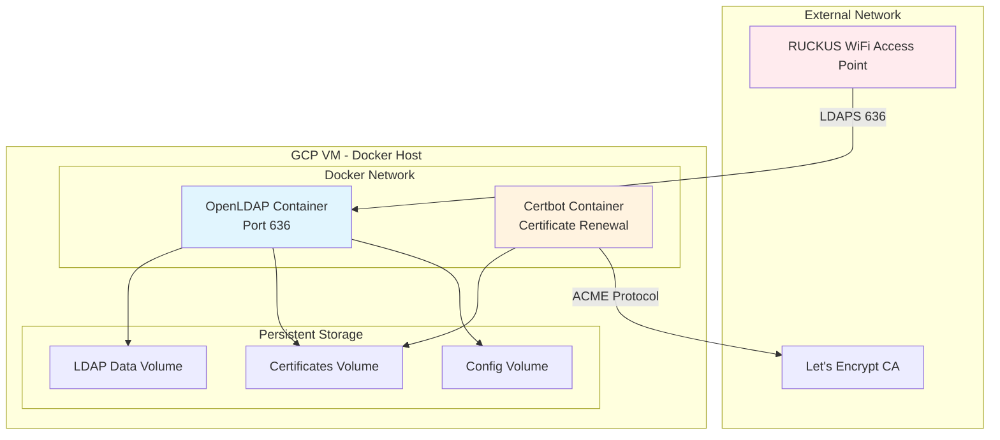
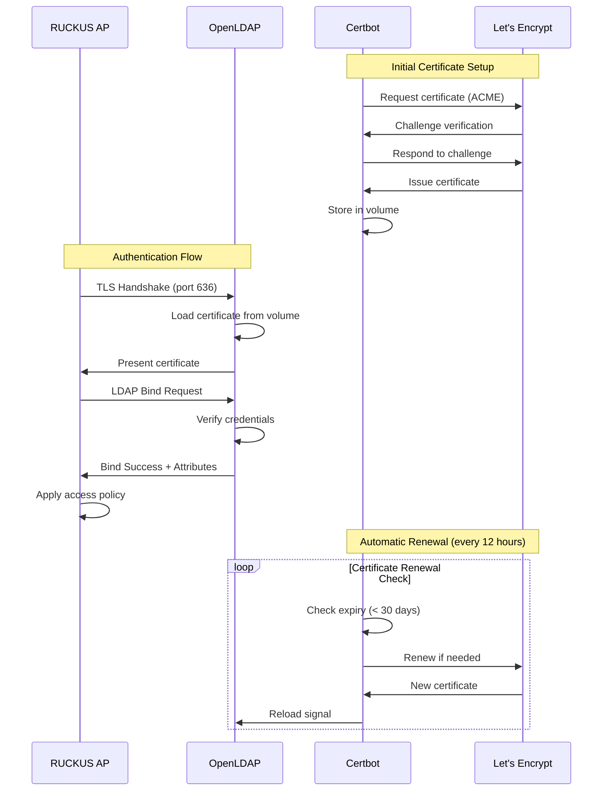
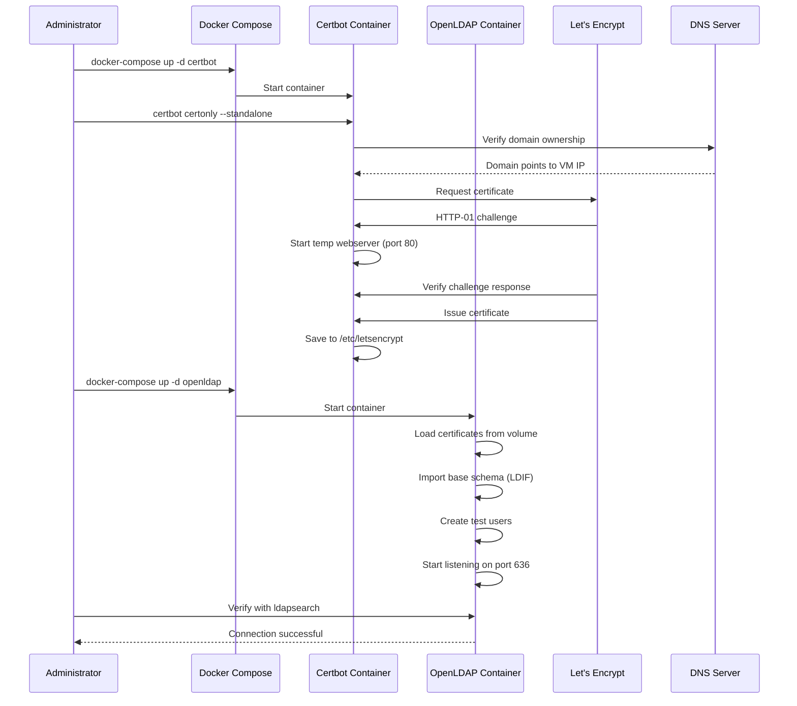
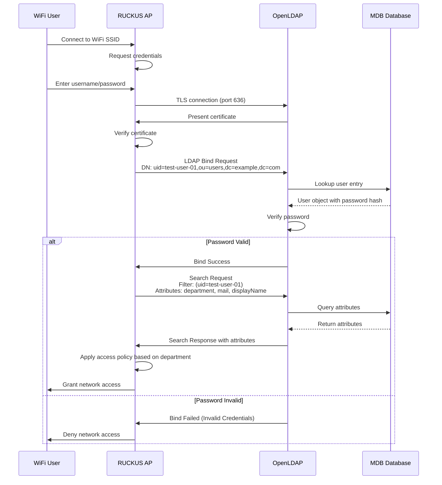
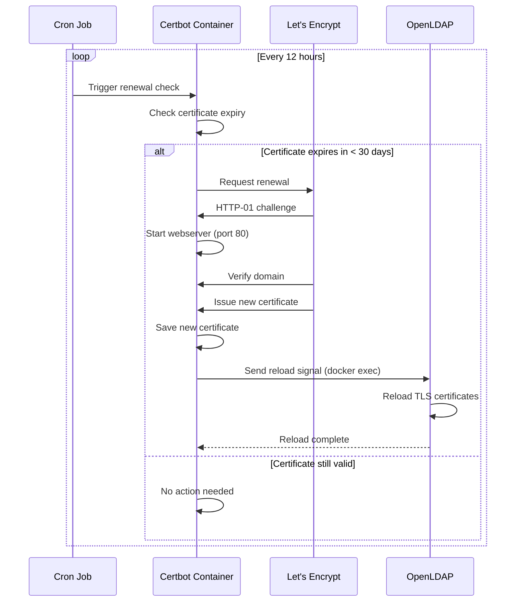
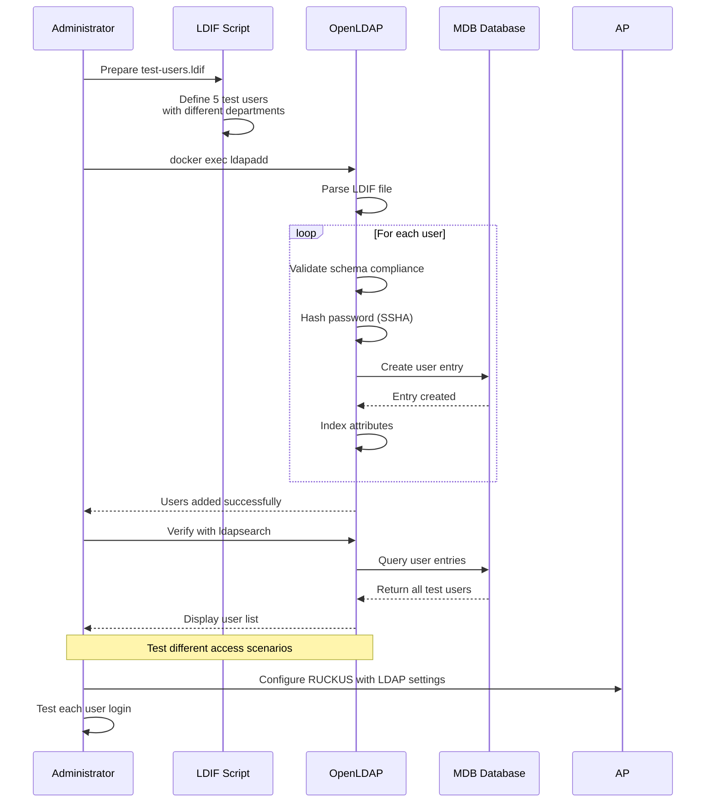
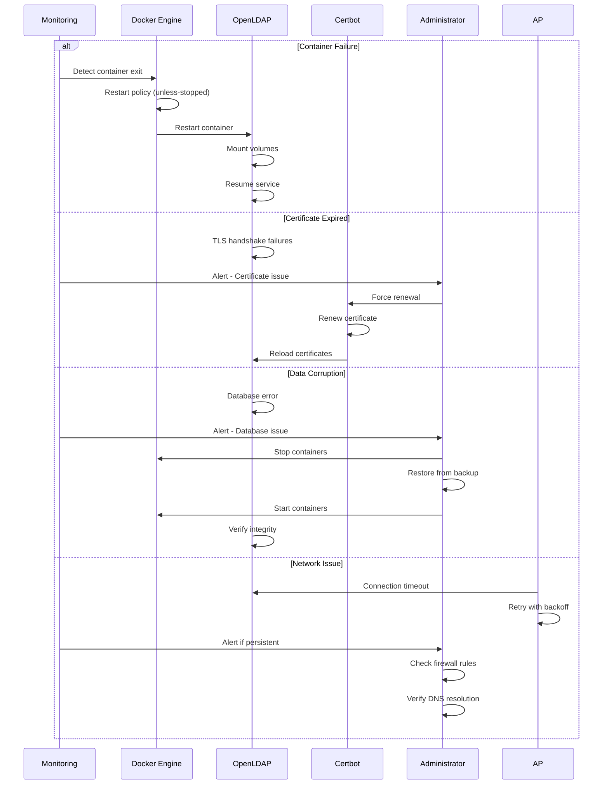

# LDAP Server for WiFi Authentication Testing - Architecture Document

## Introduction

This document outlines the overall project architecture for LDAP Server for WiFi Authentication Testing, including backend systems, shared services, and non-UI specific concerns. Its primary goal is to serve as the guiding architectural blueprint for AI-driven development, ensuring consistency and adherence to chosen patterns and technologies.

**Relationship to Frontend Architecture:**
If the project includes a significant user interface, a separate Frontend Architecture Document will detail the frontend-specific design and MUST be used in conjunction with this document. Core technology stack choices documented herein (see "Tech Stack") are definitive for the entire project, including any frontend components.

### Starter Template or Existing Project

N/A - No starter template. We'll design the Docker Compose configuration from scratch.

### Change Log

| Date | Version | Description | Author |
|------|---------|-------------|--------|
| 2025-08-19 | 1.0 | Initial architecture document creation | Winston (Architect) |

## High Level Architecture

### Technical Summary

The LDAP server deployment follows a containerized microservices architecture using Docker Compose on GCP infrastructure. The system provides secure LDAP authentication services through OpenLDAP with automated TLS certificate management via Let's Encrypt. The architecture emphasizes security with LDAPS encryption, operational simplicity through Docker containerization, and production readiness with automated certificate renewal and data persistence. This design directly supports the PRD goal of providing reliable WiFi authentication testing with RUCKUS One Access Points.

### High Level Overview

**Architectural Style:** Containerized Microservices
- Primary service: OpenLDAP server container
- Supporting service: Certbot container for certificate management
- Orchestration: Docker Compose for service coordination

**Repository Structure:** Single repository (Monorepo approach)
- All configuration, scripts, and data schemas in one repository
- Simplified deployment and version control
- Infrastructure as Code alongside application configuration

**Service Architecture:** Multi-container Docker application
- Separation of concerns between LDAP service and certificate management
- Shared volumes for certificate and data persistence
- Network isolation with explicit port exposure

**Primary Data Flow:**
1. WiFi Access Point initiates TLS connection to LDAP server
2. TLS handshake using Let's Encrypt certificates
3. LDAP bind request with username/password
4. Attribute retrieval for access control decisions
5. Response to Access Point for authentication decision

**Key Architectural Decisions:**
- Docker Compose over Kubernetes: Simpler for single-node deployment
- OpenLDAP over alternatives: Mature, well-documented, lightweight
- Let's Encrypt for certificates: Free, automated, widely trusted
- Persistent volumes: Ensures data survives container restarts

### High Level Project Diagram



### Architectural and Design Patterns

- **Container Orchestration Pattern:** Docker Compose for multi-container coordination - *Rationale:* Provides service dependencies, networking, and volume management without Kubernetes complexity
- **Sidecar Pattern:** Certbot container as sidecar for certificate management - *Rationale:* Separation of concerns, independent scaling/updates, follows single responsibility principle
- **Data Persistence Pattern:** Volume mounts for stateful data - *Rationale:* Ensures data survives container lifecycle, enables backup strategies, supports container immutability
- **Security-First Pattern:** TLS encryption by default with LDAPS - *Rationale:* Meets security requirements, prevents credential interception, industry best practice for LDAP
- **Infrastructure as Code:** Docker Compose YAML for reproducible deployments - *Rationale:* Version controlled infrastructure, consistent environments, simplified disaster recovery
- **Service Discovery Pattern:** Fixed ports and DNS resolution - *Rationale:* Predictable service endpoints for Access Point configuration, simplified network architecture

## Tech Stack

### Cloud Infrastructure

- **Provider:** Google Cloud Platform (GCP)
- **Key Services:** Compute Engine (VM hosting), Cloud DNS (optional), Cloud Logging (monitoring)
- **Deployment Regions:** Single region (user's existing VM region)

### Technology Stack Table

| Category | Technology | Version | Purpose | Rationale |
|----------|------------|---------|---------|-----------|
| **Container Runtime** | Docker CE | 24.0.7 | Container execution environment | Industry standard, excellent ecosystem, free |
| **Orchestration** | Docker Compose | 2.23.3 | Multi-container orchestration | Declarative config, simple for single-node, handles networking/volumes |
| **LDAP Server** | OpenLDAP | 2.6.6 | Directory service implementation | Mature, lightweight, excellent Docker images available |
| **Base OS (Containers)** | Alpine Linux | 3.19 | Container operating system | Minimal attack surface, small image size, security-focused |
| **Certificate Manager** | Certbot | 2.7.4 | Let's Encrypt certificate automation | Automated renewal, ACME protocol support, proven reliability |
| **Certificate Authority** | Let's Encrypt | N/A | TLS certificate provider | Free, trusted by all browsers, automated issuance |
| **Scripting** | Bash | 5.x | Automation and utilities | Native to Linux, simple for container operations |
| **Configuration Format** | YAML | 1.2 | Docker Compose and config files | Human-readable, standard for Docker ecosystem |
| **LDAP Schema Language** | LDIF | N/A | LDAP data definition | Standard format for LDAP data import/export |
| **Monitoring** | Docker Logs | Native | Container log management | Built-in, no additional overhead, integrates with GCP |
| **DNS Management** | External DNS | N/A | Domain resolution | Using existing domain pointed to GCP VM |

## Data Models

### User Entry Model

**Purpose:** Represents user accounts for WiFi authentication testing

**Key Attributes:**
- `uid`: String - Unique username for authentication (e.g., "test-user-01")
- `userPassword`: Hashed String - SSHA or PBKDF2 hashed password
- `cn` (Common Name): String - User's full name
- `sn` (Surname): String - User's last name
- `displayName`: String - Display name for RUCKUS One
- `mail`: String - Email address (required by RUCKUS)
- `telephoneNumber`: String - Phone number (required by RUCKUS)
- `department`: String - Department for access control (Custom Attribute 1)
- `employeeType`: String - Employment type for policy testing
- `objectClass`: Array - LDAP object classes (inetOrgPerson, organizationalPerson, person)

**Relationships:**
- Member of organizational unit (ou=users)
- Can be member of groups (memberOf attribute)
- References organization (o=example,dc=com)

### Group Entry Model

**Purpose:** Represents groups for role-based access control

**Key Attributes:**
- `cn`: String - Group name (e.g., "wifi-users")
- `description`: String - Group purpose and access level
- `member`: Array of DNs - Distinguished names of group members
- `objectClass`: Array - groupOfNames

**Relationships:**
- Contains references to User entries via member attribute
- Contained within organizational unit (ou=groups)

### Organizational Unit Model

**Purpose:** Logical containers for organizing directory entries

**Key Attributes:**
- `ou`: String - Organizational unit name (e.g., "users", "groups")
- `description`: String - Purpose of the organizational unit
- `objectClass`: organizationalUnit

**Relationships:**
- Parent of User and Group entries
- Child of root organization entry

### Organization Model (Root)

**Purpose:** Root of the LDAP directory tree

**Key Attributes:**
- `o`: String - Organization name
- `dc`: String - Domain component (e.g., "example", "com")
- `objectClass`: Array - organization, dcObject

**Relationships:**
- Parent of all organizational units
- Defines the base DN for the directory

## Components

### OpenLDAP Server Container

**Responsibility:** Primary LDAP directory service providing authentication and attribute retrieval for WiFi access points

**Key Interfaces:**
- LDAPS port 636 (TLS-encrypted LDAP)
- LDAP port 389 (optional, for initial setup only)
- Health check endpoint via ldapsearch command

**Dependencies:** 
- Certificates volume (read-only mount)
- Data volume (read-write mount)
- Configuration volume (read-only mount)

**Technology Stack:** 
- Base image: osixia/openldap:1.5.0 or bitnami/openldap:2.6.6
- Alpine Linux base OS
- OpenLDAP 2.6.6 with TLS support
- MDB database backend for performance

### Certbot Container

**Responsibility:** Automated Let's Encrypt certificate acquisition and renewal for TLS encryption

**Key Interfaces:**
- HTTP port 80 (for ACME challenge during renewal)
- Cron-based renewal check (twice daily)
- Certificate update notification to OpenLDAP

**Dependencies:**
- Certificates volume (read-write mount)
- Domain DNS must resolve to GCP VM IP
- Internet connectivity for Let's Encrypt API

**Technology Stack:**
- Base image: certbot/certbot:v2.7.4
- Alpine Linux base OS
- Certbot 2.7.4 with standalone plugin
- Bash scripts for renewal automation

### Docker Network

**Responsibility:** Internal communication and network isolation between containers

**Key Interfaces:**
- Bridge network for container-to-container communication
- Port mapping for external access (636, 80)
- DNS resolution for container names

**Dependencies:** Docker daemon network subsystem

**Technology Stack:** Docker bridge network driver with custom subnet

### Persistent Volumes

**Responsibility:** Data persistence and configuration management across container lifecycles

**Key Interfaces:**
- LDAP Data Volume: /var/lib/ldap (database files)
- Certificates Volume: /etc/letsencrypt (SSL certificates)
- Configuration Volume: /etc/ldap/slapd.d (OpenLDAP config)
- Schema Volume: /ldifs (LDIF import files)

**Dependencies:** Host filesystem with appropriate permissions

**Technology Stack:** Docker named volumes with local driver

### Component Diagrams

```mermaid
graph LR
    subgraph "Docker Compose Stack"
        subgraph "OpenLDAP Container"
            SLAPD[slapd process]
            MDB[(MDB Database)]
            TLS[TLS Handler]
        end
        
        subgraph "Certbot Container"
            CERTBOT[certbot process]
            RENEW[Renewal Script]
            ACME[ACME Client]
        end
        
        subgraph "Shared Volumes"
            CERTS[/etc/letsencrypt]
            DATA[/var/lib/ldap]
            CONFIG[/etc/ldap]
            SCHEMA[/ldifs]
        end
    end
    
    subgraph "External Connections"
        RUCKUS[RUCKUS AP]
        LETSENCRYPT[Let's Encrypt]
    end
    
    RUCKUS -->|LDAPS:636| TLS
    TLS --> SLAPD
    SLAPD --> MDB
    
    CERTBOT --> ACME
    ACME -->|HTTP:80| LETSENCRYPT
    RENEW --> CERTBOT
    
    TLS -.->|read| CERTS
    CERTBOT -.->|write| CERTS
    SLAPD -.->|read/write| DATA
    SLAPD -.->|read| CONFIG
    SLAPD -.->|read| SCHEMA
    
    style SLAPD fill:#e1f5fe
    style CERTBOT fill:#fff3e0
    style RUCKUS fill:#ffebee
```



## External APIs

### Let's Encrypt ACME API

- **Purpose:** Automated certificate issuance and renewal for TLS encryption
- **Documentation:** https://letsencrypt.org/docs/client-options/
- **Base URL(s):** https://acme-v02.api.letsencrypt.org/directory
- **Authentication:** ACME protocol with domain validation
- **Rate Limits:** 50 certificates per registered domain per week, 5 duplicate certificates per week

**Key Endpoints Used:**
- `POST /acme/new-order` - Request new certificate order
- `POST /acme/authz/{authz-id}` - Complete authorization challenge
- `POST /acme/finalize/{order-id}` - Finalize certificate issuance
- `POST /acme/cert/{cert-id}` - Download issued certificate

**Integration Notes:** 
- Certbot handles all ACME protocol complexity
- HTTP-01 challenge requires port 80 to be accessible
- Automatic retry logic built into Certbot
- Staging environment available for testing without rate limits

### GCP Instance Metadata API (Optional)

- **Purpose:** Retrieve VM metadata and manage instance configuration
- **Documentation:** https://cloud.google.com/compute/docs/metadata/overview
- **Base URL(s):** http://metadata.google.internal/computeMetadata/v1/
- **Authentication:** Metadata-Flavor: Google header required
- **Rate Limits:** No specific limits for metadata access

**Key Endpoints Used:**
- `GET /instance/network-interfaces/0/access-configs/0/external-ip` - Retrieve external IP for validation
- `GET /instance/hostname` - Get instance hostname
- `GET /instance/zone` - Retrieve zone information

**Integration Notes:**
- Only accessible from within GCP VM
- Can be used for dynamic configuration
- Useful for automated DNS validation if needed

## Core Workflows

### Initial Setup Workflow



### User Authentication Workflow



### Certificate Renewal Workflow



### Test User Management Workflow



### Error Recovery Workflow



## REST API Spec

N/A - This project uses LDAP protocol (port 636) rather than REST API. All authentication and attribute queries use standard LDAP operations (bind, search, compare).

## Database Schema

### LDAP Directory Information Tree (DIT) Structure

```
dc=example,dc=com                              # Root organization
├── ou=users                                   # Users container
│   ├── uid=test-user-01                      # IT employee
│   ├── uid=test-user-02                      # Guest user
│   ├── uid=test-user-03                      # Admin user
│   ├── uid=test-user-04                      # Contractor
│   └── uid=test-user-05                      # VIP/Executive
└── ou=groups                                  # Groups container
    ├── cn=wifi-users                         # Basic WiFi access
    ├── cn=wifi-admins                        # Admin WiFi access
    └── cn=wifi-guests                        # Guest WiFi access
```

### Base Schema (base.ldif)

```ldif
# Organization root
dn: dc=example,dc=com
objectClass: top
objectClass: dcObject
objectClass: organization
o: Example Organization
dc: example

# Users organizational unit
dn: ou=users,dc=example,dc=com
objectClass: top
objectClass: organizationalUnit
ou: users
description: User accounts for WiFi authentication

# Groups organizational unit
dn: ou=groups,dc=example,dc=com
objectClass: top
objectClass: organizationalUnit
ou: groups
description: Groups for access control
```

### User Schema Template (test-users.ldif)

```ldif
# Test User 01 - IT Employee
dn: uid=test-user-01,ou=users,dc=example,dc=com
objectClass: top
objectClass: person
objectClass: organizationalPerson
objectClass: inetOrgPerson
uid: test-user-01
cn: Test User One
sn: One
displayName: Test User One
mail: test.user01@example.com
telephoneNumber: +1-555-0101
department: IT
employeeType: Full-Time
userPassword: {SSHA}encrypted_password_here
description: IT department employee with full access

# Test User 02 - Guest
dn: uid=test-user-02,ou=users,dc=example,dc=com
objectClass: top
objectClass: person
objectClass: organizationalPerson
objectClass: inetOrgPerson
uid: test-user-02
cn: Guest User
sn: User
displayName: Guest User
mail: guest.user@example.com
telephoneNumber: +1-555-0102
department: Guest
employeeType: Visitor
userPassword: {SSHA}encrypted_password_here
description: Guest user with limited access

# Test User 03 - Admin
dn: uid=test-user-03,ou=users,dc=example,dc=com
objectClass: top
objectClass: person
objectClass: organizationalPerson
objectClass: inetOrgPerson
uid: test-user-03
cn: Admin User
sn: User
displayName: Admin User
mail: admin.user@example.com
telephoneNumber: +1-555-0103
department: IT
employeeType: Admin
userPassword: {SSHA}encrypted_password_here
description: Administrator with full privileges

# Test User 04 - Contractor
dn: uid=test-user-04,ou=users,dc=example,dc=com
objectClass: top
objectClass: person
objectClass: organizationalPerson
objectClass: inetOrgPerson
uid: test-user-04
cn: Contractor User
sn: User
displayName: Contractor User
mail: contractor@example.com
telephoneNumber: +1-555-0104
department: External
employeeType: Contractor
userPassword: {SSHA}encrypted_password_here
description: External contractor with restricted access

# Test User 05 - Executive
dn: uid=test-user-05,ou=users,dc=example,dc=com
objectClass: top
objectClass: person
objectClass: organizationalPerson
objectClass: inetOrgPerson
uid: test-user-05
cn: VIP User
sn: User
displayName: VIP User
mail: vip.user@example.com
telephoneNumber: +1-555-0105
department: Executive
employeeType: Full-Time
userPassword: {SSHA}encrypted_password_here
description: Executive user with VIP network access
```

### Group Schema (groups.ldif)

```ldif
# WiFi Users Group
dn: cn=wifi-users,ou=groups,dc=example,dc=com
objectClass: top
objectClass: groupOfNames
cn: wifi-users
description: Standard WiFi access group
member: uid=test-user-01,ou=users,dc=example,dc=com
member: uid=test-user-04,ou=users,dc=example,dc=com
member: uid=test-user-05,ou=users,dc=example,dc=com

# WiFi Admins Group
dn: cn=wifi-admins,ou=groups,dc=example,dc=com
objectClass: top
objectClass: groupOfNames
cn: wifi-admins
description: Administrative WiFi access
member: uid=test-user-03,ou=users,dc=example,dc=com

# WiFi Guests Group
dn: cn=wifi-guests,ou=groups,dc=example,dc=com
objectClass: top
objectClass: groupOfNames
cn: wifi-guests
description: Guest WiFi access only
member: uid=test-user-02,ou=users,dc=example,dc=com
```

### OpenLDAP Configuration (slapd.conf excerpts)

```conf
# Database configuration
database        mdb
maxsize         1073741824
suffix          "dc=example,dc=com"
rootdn          "cn=admin,dc=example,dc=com"
rootpw          {SSHA}admin_password_hash

# Indices for performance
index   objectClass     eq
index   uid             eq,sub
index   cn              eq,sub
index   mail            eq,sub
index   department      eq
index   employeeType    eq
index   memberOf        eq
index   member          eq

# Access Control Lists (ACLs)
access to attrs=userPassword
    by self write
    by anonymous auth
    by * none

access to dn.base="" 
    by * read

access to *
    by self write
    by users read
    by anonymous auth
```

### Password Generation Script (generate-passwords.sh)

```bash
#!/bin/bash
# Generate SSHA passwords for test users

slappasswd -h {SSHA} -s "TestPass123!" # For test users
slappasswd -h {SSHA} -s "AdminPass456!" # For admin user
slappasswd -h {SSHA} -s "GuestPass789!" # For guest user
```

## Source Tree

```
ldap-wifi-auth/
├── docker-compose.yml              # Main orchestration file
├── .env.example                    # Environment variables template
├── .env                           # Environment variables (gitignored)
├── README.md                      # Project documentation
├── Makefile                       # Common operations automation
│
├── config/                        # Configuration files
│   ├── openldap/
│   │   ├── ldap.conf             # LDAP client configuration
│   │   └── slapd.conf            # OpenLDAP server configuration
│   └── certbot/
│       └── cli.ini               # Certbot configuration
│
├── scripts/                       # Automation scripts
│   ├── init-certificates.sh      # Initial cert acquisition
│   ├── renew-certificates.sh     # Certificate renewal script
│   ├── backup-ldap.sh            # Backup LDAP data
│   ├── restore-ldap.sh          # Restore LDAP data
│   ├── health-check.sh           # Service health verification
│   └── generate-passwords.sh     # Password hash generator
│
├── ldifs/                         # LDAP data definitions
│   ├── 01-base.ldif              # Base directory structure
│   ├── 02-users.ldif             # Test user accounts
│   ├── 03-groups.ldif            # Group definitions
│   └── 04-acls.ldif              # Access control lists
│
├── volumes/                       # Docker volume mount points
│   ├── ldap-data/                # LDAP database (gitignored)
│   ├── ldap-config/              # LDAP configuration (gitignored)
│   ├── certificates/             # TLS certificates (gitignored)
│   └── backups/                  # Backup files (gitignored)
│
├── tests/                         # Test scripts
│   ├── test-authentication.sh    # Auth testing script
│   ├── test-attributes.sh        # Attribute query tests
│   ├── test-tls.sh               # TLS connection tests
│   └── load-test.sh             # Performance testing
│
├── docs/                          # Documentation
│   ├── architecture.md           # This document
│   ├── prd.md                    # Product requirements
│   ├── brainstorming-session-results.md
│   ├── deployment-guide.md       # Step-by-step deployment
│   ├── troubleshooting.md        # Common issues and solutions
│   └── ruckus-integration.md     # RUCKUS One configuration
│
└── monitoring/                    # Monitoring configuration
    ├── docker-compose.monitor.yml # Optional monitoring stack
    └── alerts/
        └── rules.yml              # Alert rules configuration
```

### Key Directory Descriptions

**config/**: Centralized configuration for both OpenLDAP and Certbot. These files are mounted into containers at runtime.

**scripts/**: Bash scripts for common operations. All scripts are idempotent and include error handling.

**ldifs/**: LDAP data files numbered for sequential import. Separation allows selective data loading.

**volumes/**: Docker volume mount points. All subdirectories are gitignored to prevent accidental credential commits.

**tests/**: Automated test scripts for validation. Can be run individually or as a suite via Makefile.

**docs/**: Comprehensive documentation including this architecture document and deployment guides.

**monitoring/**: Optional monitoring stack configuration. Can be enabled for production deployments.

### File Naming Conventions

- LDIF files: Numbered prefix for import order (01-, 02-, etc.)
- Scripts: Descriptive names with .sh extension
- Config files: Service-specific directories
- Documentation: Kebab-case markdown files

### Docker Compose Structure

The main `docker-compose.yml` defines:
- OpenLDAP service with volume mounts
- Certbot service for certificate management
- Shared network configuration
- Environment variable references

Optional `docker-compose.monitor.yml` adds:
- Prometheus for metrics collection
- Grafana for visualization
- Alert manager for notifications

## Infrastructure and Deployment

### Infrastructure as Code

- **Tool:** Docker Compose 2.23.3
- **Location:** `./docker-compose.yml` and `.env` files
- **Approach:** Declarative container orchestration with environment-specific configuration via .env files

### Deployment Strategy

- **Strategy:** Blue-Green deployment with Docker Compose profiles
- **CI/CD Platform:** GitHub Actions (optional) or manual deployment via Makefile
- **Pipeline Configuration:** `.github/workflows/deploy.yml` (if using CI/CD)

### Environments

- **Development:** Local Docker environment with self-signed certificates - Testing and development
- **Staging:** GCP VM with Let's Encrypt staging API - Pre-production testing without rate limits
- **Production:** GCP VM with Let's Encrypt production API - Live WiFi authentication service

### Environment Promotion Flow

```
Development (Local)
    ↓ (Test & Validate)
Staging (GCP + LE Staging)
    ↓ (Integration Testing)
Production (GCP + LE Production)
```

### Rollback Strategy

- **Primary Method:** Docker image tagging and docker-compose rollback
- **Trigger Conditions:** Failed health checks, certificate issues, authentication failures
- **Recovery Time Objective:** < 5 minutes

### Deployment Procedures

#### Initial Deployment

```bash
# 1. Clone repository to GCP VM
git clone <repository-url> ldap-wifi-auth
cd ldap-wifi-auth

# 2. Configure environment
cp .env.example .env
# Edit .env with domain, email, passwords

# 3. Initialize certificates
make init-certs

# 4. Deploy services
make deploy

# 5. Verify deployment
make test
```

#### Update Deployment

```bash
# 1. Pull latest changes
git pull origin main

# 2. Backup current data
make backup

# 3. Deploy updates
make deploy-update

# 4. Verify services
make health-check

# 5. Rollback if needed
make rollback
```

### Docker Compose Configuration

```yaml
# docker-compose.yml (simplified)
version: '3.8'

services:
  openldap:
    image: osixia/openldap:${OPENLDAP_VERSION:-1.5.0}
    container_name: openldap
    restart: unless-stopped
    ports:
      - "636:636"
      - "389:389"
    environment:
      - LDAP_ORGANISATION=${LDAP_ORG}
      - LDAP_DOMAIN=${LDAP_DOMAIN}
      - LDAP_ADMIN_PASSWORD=${LDAP_ADMIN_PASS}
      - LDAP_TLS=true
      - LDAP_TLS_CRT_FILENAME=cert.pem
      - LDAP_TLS_KEY_FILENAME=privkey.pem
      - LDAP_TLS_CA_CRT_FILENAME=fullchain.pem
    volumes:
      - ldap-data:/var/lib/ldap
      - ldap-config:/etc/ldap/slapd.d
      - certificates:/container/service/slapd/assets/certs:ro
      - ./ldifs:/ldifs:ro
    networks:
      - ldap-network
    healthcheck:
      test: ["CMD", "ldapsearch", "-x", "-H", "ldap://localhost", "-b", "", "-s", "base"]
      interval: 30s
      timeout: 10s
      retries: 3

  certbot:
    image: certbot/certbot:${CERTBOT_VERSION:-v2.7.4}
    container_name: certbot
    restart: unless-stopped
    ports:
      - "80:80"
    volumes:
      - certificates:/etc/letsencrypt
      - certbot-www:/var/www/certbot
    entrypoint: "/bin/sh -c 'trap exit TERM; while :; do certbot renew; sleep 12h & wait $${!}; done;'"
    networks:
      - ldap-network

volumes:
  ldap-data:
    driver: local
  ldap-config:
    driver: local
  certificates:
    driver: local
  certbot-www:
    driver: local

networks:
  ldap-network:
    driver: bridge
```

### Makefile Targets

```makefile
# Key deployment targets
.PHONY: deploy init-certs backup restore health-check

deploy:
	docker-compose up -d

init-certs:
	./scripts/init-certificates.sh

backup:
	./scripts/backup-ldap.sh

restore:
	./scripts/restore-ldap.sh

health-check:
	./scripts/health-check.sh

test:
	./tests/test-authentication.sh
	./tests/test-attributes.sh
	./tests/test-tls.sh

rollback:
	docker-compose down
	docker-compose up -d --force-recreate
```

### GCP Infrastructure Requirements

#### Firewall Rules
```bash
# Required firewall rules
gcloud compute firewall-rules create allow-ldaps \
  --allow tcp:636 \
  --source-ranges 0.0.0.0/0 \
  --description "Allow LDAPS for WiFi authentication"

gcloud compute firewall-rules create allow-http-acme \
  --allow tcp:80 \
  --source-ranges 0.0.0.0/0 \
  --description "Allow HTTP for Let's Encrypt ACME"
```

#### VM Specifications
- **Machine Type:** e2-micro (minimum) or e2-small (recommended)
- **Boot Disk:** 20GB SSD
- **OS:** Ubuntu 22.04 LTS or Debian 12
- **Network:** Static external IP address
- **Region:** Closest to WiFi AP location for minimal latency

### Monitoring and Alerting

- **Health Checks:** Every 30 seconds via ldapsearch
- **Log Aggregation:** Docker logs to GCP Cloud Logging
- **Metrics:** Container resource usage via Docker stats
- **Alerts:** Certificate expiry, container failures, authentication failures

### Backup Strategy

- **Frequency:** Daily automated backups
- **Retention:** 7 daily, 4 weekly backups
- **Location:** `./volumes/backups/` and optional GCS bucket
- **Recovery:** Scripted restore process with verification

## Error Handling Strategy

### General Approach

- **Error Model:** Fail-fast with automatic recovery where possible
- **Exception Hierarchy:** System errors (infrastructure) vs Application errors (LDAP operations)
- **Error Propagation:** Log locally, alert on critical failures, auto-recover on transient issues

### Logging Standards

- **Library:** Docker native logging with json-file driver
- **Format:** JSON structured logs with timestamp, service, level, and message
- **Levels:** ERROR (failures), WARN (degraded), INFO (operations), DEBUG (troubleshooting)
- **Required Context:**
  - Correlation ID: Container ID and request timestamp
  - Service Context: Container name and version
  - User Context: Anonymized user DN (no passwords ever logged)

### Error Handling Patterns

#### External API Errors

**Let's Encrypt Certificate Renewal Failures:**
- **Retry Policy:** Exponential backoff - 1h, 2h, 4h, 8h, then alert
- **Circuit Breaker:** After 5 consecutive failures, switch to manual intervention mode
- **Timeout Configuration:** 30 seconds for ACME operations
- **Error Translation:** Map ACME errors to admin-friendly messages

Example handling:
```bash
# scripts/renew-certificates.sh
renew_with_retry() {
    local attempt=1
    local max_attempts=5
    local backoff=3600  # Start with 1 hour
    
    while [ $attempt -le $max_attempts ]; do
        if certbot renew --non-interactive; then
            echo "Certificate renewed successfully"
            return 0
        fi
        
        echo "Renewal attempt $attempt failed, waiting ${backoff}s"
        sleep $backoff
        backoff=$((backoff * 2))
        attempt=$((attempt + 1))
    done
    
    alert_admin "Certificate renewal failed after $max_attempts attempts"
    return 1
}
```

#### LDAP Service Errors

**Authentication Failures:**
- **Invalid Credentials:** Return clear LDAP error code 49, log attempt without password
- **Connection Issues:** Auto-restart container via Docker restart policy
- **TLS Certificate Problems:** Health check fails, triggers container restart
- **Database Corruption:** Restore from latest backup, alert administrator

Example LDAP error codes:
```
49 - Invalid credentials
52 - Unavailable (server shutting down)
53 - Unwilling to perform (TLS required but not used)
68 - Entry already exists
80 - Internal error
```

#### Business Logic Errors

**User Management Errors:**
- **Custom Exceptions:** Duplicate user, invalid attributes, schema violations
- **User-Facing Errors:** "User already exists", "Required attribute missing: mail"
- **Error Codes:** Standard LDAP result codes for client compatibility

**Access Policy Errors:**
- **Department Not Found:** Default to most restrictive access
- **Attribute Missing:** Log warning, use default values
- **Group Membership Issues:** Validate group exists before adding members

#### Data Consistency

**Transaction Strategy:**
- **LDAP Operations:** Single operation atomicity (LDAP doesn't support multi-op transactions)
- **Backup Consistency:** Stop LDAP writes during backup via read-only mode
- **Certificate Updates:** Atomic file replacement with symlink switching

**Compensation Logic:**
- **Failed User Creation:** Remove partial entry if attributes fail validation
- **Group Membership:** Validate both user and group exist before linking
- **Certificate Rollback:** Keep previous certificate until new one is verified

**Idempotency:**
- **User Creation:** Check existence before adding (error code 68 if exists)
- **Certificate Renewal:** Safe to run multiple times
- **Container Deployment:** Docker Compose is inherently idempotent

### Container-Level Error Handling

```yaml
# docker-compose.yml error handling
services:
  openldap:
    restart: unless-stopped  # Auto-restart on failure
    healthcheck:
      test: ["CMD", "ldapsearch", "-x", "-H", "ldap://localhost"]
      interval: 30s
      timeout: 10s
      retries: 3
      start_period: 60s
    logging:
      driver: json-file
      options:
        max-size: "10m"
        max-file: "3"
        labels: "service=openldap"
```

### Monitoring and Alerting

```bash
# scripts/health-check.sh
#!/bin/bash
set -e

# Check LDAP service
if ! ldapsearch -x -H ldaps://localhost:636 -b "" -s base > /dev/null 2>&1; then
    echo "ERROR: LDAP service not responding on port 636"
    exit 1
fi

# Check certificate validity
CERT_EXPIRY=$(openssl s_client -connect localhost:636 < /dev/null 2>/dev/null | \
    openssl x509 -noout -enddate | cut -d= -f2)
EXPIRY_EPOCH=$(date -d "$CERT_EXPIRY" +%s)
CURRENT_EPOCH=$(date +%s)
DAYS_LEFT=$(( ($EXPIRY_EPOCH - $CURRENT_EPOCH) / 86400 ))

if [ $DAYS_LEFT -lt 7 ]; then
    echo "WARNING: Certificate expires in $DAYS_LEFT days"
    # Trigger renewal
    docker exec certbot certbot renew --force-renewal
fi

# Check disk space
DISK_USAGE=$(df /var/lib/docker | awk 'NR==2 {print $5}' | sed 's/%//')
if [ $DISK_USAGE -gt 80 ]; then
    echo "WARNING: Disk usage at ${DISK_USAGE}%"
fi
```

### Recovery Procedures

**Automated Recovery:**
1. Container crashes → Docker restart policy
2. Certificate expiry → Certbot auto-renewal
3. Network issues → Connection retry with backoff
4. Health check failures → Container restart

**Manual Recovery Procedures:**
1. **Data corruption:** `make restore` from backup
2. **Certificate issues:** `make force-renew-cert`
3. **Complete failure:** `make disaster-recovery`
4. **Performance degradation:** `make restart-services`

### Error Response Matrix

| Error Type | Detection | Automatic Action | Manual Action | Alert Level |
|------------|-----------|------------------|---------------|-------------|
| Container crash | Docker daemon | Restart container | Check logs | WARN |
| Certificate expiry | Health check | Force renewal | Manual renewal | ERROR |
| LDAP bind failure | Client timeout | None | Check credentials | INFO |
| Disk full | Health check | Log rotation | Cleanup | ERROR |
| Network unreachable | Connection error | Retry with backoff | Check firewall | WARN |
| Database corruption | LDAP errors | None | Restore backup | CRITICAL |
| Memory exhaustion | OOM killer | Restart container | Increase limits | ERROR |

## Coding Standards

**Note:** This section defines MANDATORY standards for scripts and configuration in this project. Keep minimal - focus only on critical rules to prevent issues.

### Core Standards

- **Languages & Runtimes:** Bash 5.x for scripts, YAML 1.2 for configuration
- **Style & Linting:** ShellCheck for bash scripts, yamllint for YAML files
- **Test Organization:** Tests in `tests/` directory, prefixed with `test-`

### Naming Conventions

| Element | Convention | Example |
|---------|------------|---------|
| Scripts | Kebab-case with .sh | `init-certificates.sh` |
| Config files | Lowercase with extension | `docker-compose.yml` |
| Environment variables | UPPERCASE_SNAKE | `LDAP_ADMIN_PASSWORD` |
| Docker containers | Lowercase, no spaces | `openldap`, `certbot` |
| Volumes | Kebab-case | `ldap-data`, `certificates` |
| LDIF files | Numbered prefix | `01-base.ldif` |

### Critical Rules

- **Never hardcode secrets:** All passwords and sensitive data must use environment variables
- **Always use set -e in bash scripts:** Scripts must fail fast on any error
- **No direct LDAP modifications:** All changes via LDIF files for auditability
- **TLS only for production:** Never allow unencrypted LDAP (port 389) in production
- **Validate before apply:** All LDIF files must be validated before import
- **Idempotent scripts:** All scripts must be safe to run multiple times

### Bash Script Standards

```bash
#!/bin/bash
# Script: example.sh
# Purpose: Brief description
# Usage: ./example.sh [args]

set -euo pipefail  # REQUIRED: Fail on error, undefined vars, pipe failures
IFS=$'\n\t'       # REQUIRED: Safe Internal Field Separator

# REQUIRED: Trap errors
trap 'echo "Error on line $LINENO"' ERR

# REQUIRED: Validate prerequisites
command -v docker >/dev/null 2>&1 || { echo "Docker required"; exit 1; }

# REQUIRED: Use functions for complex logic
main() {
    # Main logic here
    echo "Starting..."
}

# REQUIRED: Call main function
main "$@"
```

### YAML Configuration Standards

```yaml
# REQUIRED: Version declaration
version: '3.8'

# REQUIRED: Explicit service configuration
services:
  service_name:
    image: image:tag  # REQUIRED: Always specify tag
    restart: unless-stopped  # REQUIRED: Define restart policy
    environment:
      - VAR=${VAR}  # REQUIRED: Use env variables for config
    healthcheck:  # REQUIRED: Health check for critical services
      test: ["CMD", "command"]
```

### LDIF Standards

```ldif
# REQUIRED: Comment header with purpose
# Purpose: Create test user
# Dependencies: Base structure must exist

# REQUIRED: Full DN specification
dn: uid=user,ou=users,dc=example,dc=com
# REQUIRED: Object classes before attributes
objectClass: inetOrgPerson
# REQUIRED: All mandatory attributes
uid: user
cn: User Name
sn: Name
# OPTIONAL: Additional attributes
mail: user@example.com
```

### Docker Standards

- **Image tags:** Never use `latest`, always specify version
- **Health checks:** Required for all services
- **Logging:** JSON driver with size limits
- **Networks:** Explicit network creation, no default bridge
- **Volumes:** Named volumes only, no bind mounts in production

### Security Standards

- **Password storage:** Only SSHA or stronger hashing
- **File permissions:** Scripts executable (755), configs readable (644)
- **Container user:** Never run as root in production containers
- **Secret rotation:** Document rotation procedures for all secrets

## Test Strategy and Standards

### Testing Philosophy

- **Approach:** Test-after development with focus on integration and functional testing
- **Coverage Goals:** 90% of critical authentication flows, 100% of security functions
- **Test Pyramid:** Emphasis on integration tests for LDAP operations, minimal unit tests for scripts

### Test Types and Organization

#### Unit Tests

- **Framework:** Bash testing with `bats` (Bash Automated Testing System)
- **File Convention:** `test-{script-name}.bats` in `tests/unit/`
- **Location:** `tests/unit/`
- **Mocking Library:** `bash_unit` for external dependencies
- **Coverage Requirement:** 80% for bash scripts

**AI Agent Requirements:**
- Test all script functions with valid and invalid inputs
- Mock external dependencies (docker, ldapsearch, certbot)
- Follow AAA pattern (Arrange, Act, Assert)
- Test error conditions and edge cases

#### Integration Tests

- **Scope:** LDAP authentication flows, certificate management, container orchestration
- **Location:** `tests/integration/`
- **Test Infrastructure:**
  - **OpenLDAP:** Docker container with test data
  - **TLS Testing:** Self-signed certificates for validation
  - **RUCKUS Simulation:** Mock LDAP client to simulate access point behavior

Example integration test structure:
```bash
#!/bin/bash
# tests/integration/test-ldap-authentication.sh

setup() {
    docker-compose -f docker-compose.test.yml up -d
    # Wait for services to be ready
    ./scripts/health-check.sh
}

test_user_authentication() {
    # Test successful authentication
    result=$(ldapsearch -x -H ldaps://localhost:636 \
        -D "uid=test-user-01,ou=users,dc=example,dc=com" \
        -w "TestPass123!" -s base -b "")
    
    assert_contains "$result" "result: 0 Success"
}

test_attribute_retrieval() {
    # Test RUCKUS required attributes
    result=$(ldapsearch -x -H ldaps://localhost:636 \
        -D "uid=test-user-01,ou=users,dc=example,dc=com" \
        -w "TestPass123!" \
        -b "uid=test-user-01,ou=users,dc=example,dc=com" \
        displayName mail telephoneNumber department)
    
    assert_contains "$result" "displayName: Test User One"
    assert_contains "$result" "department: IT"
}

teardown() {
    docker-compose -f docker-compose.test.yml down -v
}
```

#### End-to-End Tests

- **Framework:** Bash scripts with LDAP client tools
- **Scope:** Complete WiFi authentication simulation from AP perspective
- **Environment:** Staging environment with real certificates
- **Test Data:** All 5 test users with different access scenarios

Example E2E test:
```bash
#!/bin/bash
# tests/e2e/test-wifi-authentication-flow.sh

test_complete_auth_flow() {
    # Simulate RUCKUS AP authentication sequence
    
    # 1. TLS connection establishment
    openssl s_client -connect ${LDAP_HOST}:636 -verify_return_error
    
    # 2. User bind (authentication)
    ldapsearch -x -H ldaps://${LDAP_HOST}:636 \
        -D "uid=test-user-01,ou=users,dc=example,dc=com" \
        -w "TestPass123!" -s base -b ""
    
    # 3. Attribute lookup for policy decisions
    attrs=$(ldapsearch -x -H ldaps://${LDAP_HOST}:636 \
        -D "uid=test-user-01,ou=users,dc=example,dc=com" \
        -w "TestPass123!" \
        -b "uid=test-user-01,ou=users,dc=example,dc=com" \
        displayName mail telephoneNumber department)
    
    # 4. Verify RUCKUS required attributes present
    echo "$attrs" | grep -q "displayName:" || exit 1
    echo "$attrs" | grep -q "mail:" || exit 1
    echo "$attrs" | grep -q "telephoneNumber:" || exit 1
    echo "$attrs" | grep -q "department:" || exit 1
}
```

### Test Data Management

- **Strategy:** LDIF-based test fixtures with automated cleanup
- **Fixtures:** `tests/fixtures/test-users.ldif`
- **Factories:** Bash functions to create test users dynamically
- **Cleanup:** Automatic removal of test data after each test run

```bash
# Test data factory
create_test_user() {
    local username="$1"
    local department="$2"
    
    cat <<EOF | ldapadd -x -H ldaps://localhost:636 -D cn=admin,dc=example,dc=com -w admin_pass
dn: uid=$username,ou=users,dc=example,dc=com
objectClass: inetOrgPerson
uid: $username
cn: Test User
sn: User
displayName: Test User
mail: $username@test.example.com
telephoneNumber: +1-555-0100
department: $department
userPassword: {SSHA}test_password_hash
EOF
}
```

### Continuous Testing

- **CI Integration:** Tests run on every commit via Makefile targets
- **Performance Tests:** Load testing with multiple concurrent authentications
- **Security Tests:** Certificate validation, TLS configuration verification

```makefile
# Makefile test targets
test-unit:
	@echo "Running unit tests..."
	cd tests/unit && bats *.bats

test-integration:
	@echo "Running integration tests..."
	./tests/integration/test-ldap-authentication.sh
	./tests/integration/test-certificate-management.sh

test-e2e:
	@echo "Running end-to-end tests..."
	./tests/e2e/test-wifi-authentication-flow.sh

test-security:
	@echo "Running security tests..."
	./tests/security/test-tls-configuration.sh
	./tests/security/test-certificate-validation.sh

test-performance:
	@echo "Running performance tests..."
	./tests/performance/test-concurrent-auth.sh

test-all: test-unit test-integration test-security test-performance test-e2e
```

### Test Environment Configuration

```yaml
# docker-compose.test.yml
version: '3.8'
services:
  openldap-test:
    image: osixia/openldap:1.5.0
    environment:
      - LDAP_ORGANISATION=Test Organization
      - LDAP_DOMAIN=test.example.com
      - LDAP_ADMIN_PASSWORD=test_admin_pass
      - LDAP_TLS=false  # Use self-signed for testing
    volumes:
      - ./tests/fixtures:/ldifs:ro
    ports:
      - "389:389"
      - "636:636"
    healthcheck:
      test: ["CMD", "ldapsearch", "-x", "-H", "ldap://localhost"]
      interval: 5s
      timeout: 3s
      retries: 5
```

### Performance Testing

```bash
#!/bin/bash
# tests/performance/test-concurrent-auth.sh

# Test 100 concurrent authentication requests
test_concurrent_authentication() {
    local concurrent_users=100
    local success_count=0
    
    for i in $(seq 1 $concurrent_users); do
        {
            ldapsearch -x -H ldaps://localhost:636 \
                -D "uid=test-user-01,ou=users,dc=example,dc=com" \
                -w "TestPass123!" -s base -b "" > /dev/null 2>&1
            if [ $? -eq 0 ]; then
                ((success_count++))
            fi
        } &
    done
    
    wait  # Wait for all background jobs
    
    success_rate=$((success_count * 100 / concurrent_users))
    echo "Success rate: ${success_rate}% ($success_count/$concurrent_users)"
    
    # Require 95% success rate
    [ $success_rate -ge 95 ] || exit 1
}
```

### Test Automation and Reporting

- **Test Runner:** Makefile targets for different test suites
- **Reporting:** TAP (Test Anything Protocol) output for CI integration
- **Coverage:** Script coverage via `bash -x` tracing
- **Results:** Test results saved to `tests/results/` with timestamps

## Security

**Note:** These security requirements are MANDATORY for implementation. All rules directly impact code generation and deployment.

### Input Validation

- **Validation Library:** Built-in OpenLDAP schema validation
- **Validation Location:** At LDAP service boundary before processing
- **Required Rules:**
  - All LDIF imports MUST be validated against schema before application
  - DN validation required for all LDAP operations
  - Attribute value length limits enforced (256 chars for most fields)
  - Character set validation (UTF-8 only, no control characters)

```bash
# MANDATORY: LDIF validation before import
validate_ldif() {
    local ldif_file="$1"
    
    # Schema validation
    ldapadd -n -f "$ldif_file" > /dev/null 2>&1 || {
        echo "ERROR: LDIF validation failed for $ldif_file"
        return 1
    }
    
    # Check for dangerous patterns
    if grep -q '[<>;&|`$]' "$ldif_file"; then
        echo "ERROR: Dangerous characters detected in $ldif_file"
        return 1
    fi
}
```

### Authentication & Authorization

- **Auth Method:** LDAP Simple Bind with TLS encryption
- **Session Management:** Stateless - each request requires authentication
- **Required Patterns:**
  - NEVER allow unencrypted authentication (port 389 disabled in production)
  - All passwords MUST use SSHA hashing minimum
  - Failed authentication attempts logged (without password)
  - No password in logs or error messages

```bash
# MANDATORY: Secure password generation
generate_secure_password() {
    local password="$1"
    slappasswd -h '{SSHA}' -s "$password"
}

# MANDATORY: Authentication logging (no passwords)
log_auth_attempt() {
    local user_dn="$1"
    local result="$2"
    echo "$(date -Iseconds) AUTH user=$user_dn result=$result" >> /var/log/ldap-auth.log
}
```

### Secrets Management

- **Development:** Environment variables in .env file (gitignored)
- **Production:** GCP Secret Manager or secure environment variables
- **Code Requirements:**
  - NEVER hardcode secrets in any file
  - Access secrets via environment variables only
  - No secrets in logs, error messages, or debugging output
  - Rotate admin passwords every 90 days

```bash
# MANDATORY: Secret validation
validate_secrets() {
    # Check for hardcoded secrets in code
    if grep -r "password.*=" --include="*.sh" --include="*.yml" .; then
        echo "ERROR: Hardcoded secrets detected"
        exit 1
    fi
    
    # Verify required environment variables
    local required_vars=("LDAP_ADMIN_PASSWORD" "LDAP_DOMAIN")
    for var in "${required_vars[@]}"; do
        if [ -z "${!var}" ]; then
            echo "ERROR: Required environment variable $var not set"
            exit 1
        fi
    done
}
```

### API Security

- **Rate Limiting:** LDAP connection limits via OpenLDAP configuration
- **CORS Policy:** N/A (LDAP protocol, not HTTP)
- **Security Headers:** TLS configuration with modern cipher suites
- **HTTPS Enforcement:** LDAPS only, no plain LDAP in production

```conf
# OpenLDAP security configuration
security tls=256  # Minimum TLS strength
TLSCipherSuite HIGH:!aNULL:!MD5
TLSProtocolMin 3.3  # TLS 1.2 minimum
TLSVerifyClient never  # Client cert not required

# Connection limits
sizelimit 1000
timelimit 30
```

### Data Protection

- **Encryption at Rest:** Docker volumes on encrypted filesystem
- **Encryption in Transit:** TLS 1.2+ for all LDAP communications
- **PII Handling:** Email addresses and phone numbers considered PII
- **Logging Restrictions:** No passwords, hashed passwords, or sensitive attributes in logs

```bash
# MANDATORY: Data encryption verification
verify_encryption() {
    # Check TLS configuration
    echo "Q" | openssl s_client -connect localhost:636 -tls1_2 > /dev/null 2>&1 || {
        echo "ERROR: TLS 1.2 not supported"
        exit 1
    }
    
    # Verify no plaintext passwords in database
    if ldapsearch -x -H ldap://localhost -b "dc=example,dc=com" userPassword | grep -v '{SSHA}'; then
        echo "ERROR: Plaintext passwords detected"
        exit 1
    fi
}
```

### Dependency Security

- **Scanning Tool:** `docker scan` for container vulnerability scanning
- **Update Policy:** Monthly security updates for base images
- **Approval Process:** Only use official Docker Hub images or verified sources

```bash
# MANDATORY: Security scanning
security_scan() {
    # Scan Docker images
    docker scan osixia/openldap:1.5.0 || echo "WARNING: Vulnerabilities detected"
    docker scan certbot/certbot:v2.7.4 || echo "WARNING: Vulnerabilities detected"
    
    # Check for outdated base images
    local image_age=$(docker inspect osixia/openldap:1.5.0 | jq -r '.[0].Created')
    local days_old=$(( ($(date +%s) - $(date -d "$image_age" +%s)) / 86400 ))
    
    if [ $days_old -gt 90 ]; then
        echo "WARNING: Base image is $days_old days old, consider updating"
    fi
}
```

### Security Testing

- **SAST Tool:** ShellCheck for bash scripts, yamllint for configurations
- **DAST Tool:** OpenVAS or nmap for network security scanning
- **Penetration Testing:** Manual testing of TLS configuration and authentication

```bash
#!/bin/bash
# tests/security/test-tls-configuration.sh

test_tls_security() {
    # Test TLS version enforcement
    echo "Q" | timeout 5 openssl s_client -connect localhost:636 -tls1_1 && {
        echo "ERROR: TLS 1.1 should be disabled"
        exit 1
    }
    
    # Test cipher suite strength
    weak_ciphers=$(echo "Q" | openssl s_client -connect localhost:636 -cipher 'LOW:EXPORT:aNULL' 2>&1 | grep 'Cipher is')
    if [ -n "$weak_ciphers" ]; then
        echo "ERROR: Weak ciphers enabled: $weak_ciphers"
        exit 1
    fi
    
    # Test certificate validation
    echo "Q" | openssl s_client -connect localhost:636 -verify_return_error || {
        echo "ERROR: Certificate validation failed"
        exit 1
    fi
}

test_authentication_security() {
    # Test that plain LDAP is disabled in production
    if [ "$ENVIRONMENT" = "production" ]; then
        ldapsearch -x -H ldap://localhost:389 -b "" -s base 2>&1 | grep -q "Can't contact LDAP server" || {
            echo "ERROR: Plain LDAP should be disabled in production"
            exit 1
        }
    fi
    
    # Test password policy enforcement
    weak_password="123"
    echo "$weak_password" | slappasswd -h '{SSHA}' -T /dev/stdin || {
        echo "INFO: Weak password rejected (expected)"
    }
}
```

### Container Security

```yaml
# Security-hardened container configuration
services:
  openldap:
    security_opt:
      - no-new-privileges:true  # Prevent privilege escalation
    read_only: true  # Read-only root filesystem
    tmpfs:
      - /tmp
      - /var/run
    user: "1001:1001"  # Non-root user
    cap_drop:
      - ALL  # Drop all capabilities
    cap_add:
      - CHOWN  # Only required capabilities
      - DAC_OVERRIDE
      - SETGID
      - SETUID
```

### Network Security

- **Firewall Rules:** Only ports 636 (LDAPS) and 80 (ACME) exposed
- **Access Control:** GCP firewall rules restrict source IPs if possible
- **Network Segmentation:** Docker bridge network isolates containers

```bash
# MANDATORY: Network security verification
verify_network_security() {
    # Check exposed ports
    exposed_ports=$(docker port openldap 2>/dev/null | wc -l)
    if [ "$exposed_ports" -gt 2 ]; then
        echo "ERROR: Too many exposed ports"
        exit 1
    fi
    
    # Verify firewall rules
    if command -v ufw >/dev/null; then
        ufw status | grep -q "636/tcp" || {
            echo "ERROR: LDAPS port not in firewall rules"
            exit 1
        }
    fi
}
```

### Compliance Requirements

- **Password Policy:** Minimum SSHA hashing, 8 character minimum
- **Audit Logging:** All authentication attempts logged
- **Data Retention:** Logs retained for 90 days minimum
- **Access Reviews:** Quarterly review of user accounts and permissions