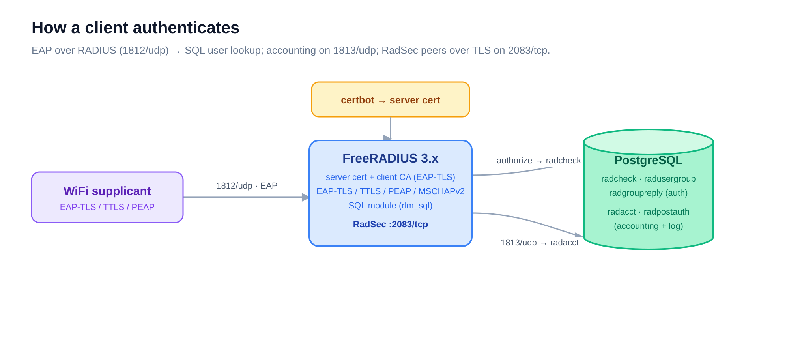

# freeradius — RADIUS authentication + accounting

> Part of the [Enterprise Authentication Testing Platform](../README.md). The WiFi
> authentication backend: it answers 802.1X / EAP requests and logs every attempt to SQL.

## What it is

A FreeRADIUS 3.x server with a **PostgreSQL-backed user store and accounting log**. Users
live in SQL (not flat files), so they can be managed and queried at runtime; every
authentication and session is written to the database. It supports the EAP methods real
enterprise WiFi uses (EAP-TLS, TTLS, PEAP/MSCHAPv2) and **RadSec** (RADIUS over TLS) for
server-to-server links.

`make deploy` brings up three containers together: **freeradius**, its **PostgreSQL**, and
the [`mcp-radius-sql`](../mcp-radius-sql/README.md) server that exposes the database over MCP.

## How it works



A supplicant authenticates over EAP (1812/udp); FreeRADIUS authorizes against the SQL
`radcheck`/`radusergroup`/`radgroupreply` tables, then logs the result to `radpostauth` and
accounting sessions to `radacct` (1813/udp). The server certificate comes from certbot; a
separate private **client CA** verifies client certificates for EAP-TLS. See
[`sql/schema.sql`](sql/schema.sql) for the full table layout and the
[`docs/`](docs/) deep dives below.

## Quickstart

```bash
make init           # env → copy-certs → copy-client-ca → build → deploy → smoke test
```

> Requires the `certbot` service running first. For EAP-TLS, set `CLIENT_CA_FILE` to your
> private CA, or run `make copy-client-ca CLIENT_CA_FILE=./your-ca.pem`.

Verify:

```bash
make test           # basic RADIUS auth (radtest)
make test-users     # every configured test user
make test-tls       # RadSec listener on 2083
```

## Make targets

| Group | Targets |
|-------|---------|
| Build / deploy | `env`, `copy-certs`, `copy-client-ca`, `build`, `build-tls`, `init`, `deploy`, `restart`, `stop`, `clean` |
| Status / logs | `status`, `logs`, `logs-follow`, `config-test` |
| Test | `test`, `test-users`, `test-tls` |
| Debug | `debug` (runs `radiusd -X`), `debug-stop` |
| Query SQL | `sql-auth`, `sql-acct`, `sql-by-mac MAC=…`, `sql-detail MAC=…`, `sql-clear` |
| MCP server | `mcp-build`, `mcp-deploy`, `mcp-stop`, `mcp-logs`, `mcp-status` |

## Configuration

`.env` (from `.env.example`) — key variables:

| Variable | Default | Purpose |
|----------|---------|---------|
| `RADIUS_DOMAIN` | `radius.example.com` | Server hostname (TLS) |
| `RADIUS_SECRET` | `testing123` | Shared secret for RADIUS clients |
| `CERTBOT_CERT_NAME` | `ldap.example.com` | Cert directory name to copy from certbot |
| `CLIENT_CA_FILE` | — | Private CA for EAP-TLS client verification |
| `POSTGRES_*` | `radius` / `radiuspass123` | Database name, user, password, host, port |
| `TEST_USER_PASSWORD` … `VIP_PASSWORD` | `*pass123` | Seeded test-user passwords |
| `MCP_TOKEN` | — | Bearer token for the MCP server (≥ 32 chars) |

## Ports

| Port | Protocol | Purpose |
|------|----------|---------|
| 1812 | UDP | RADIUS authentication |
| 1813 | UDP | RADIUS accounting |
| 2083 | TCP | RadSec (RADIUS over TLS) |
| 3443 | TCP | `mcp-radius-sql` (HTTPS) — see its [README](../mcp-radius-sql/README.md) |

PostgreSQL (5432) stays on the internal Docker network.

## Test users

Seeded into `radcheck` from `.env` (the same five identities as the `ldap` directory):

| Username | Group | Notes |
|----------|-------|-------|
| `test` | users | — |
| `guest` | guests | Session-Timeout 3600 (via group) |
| `admin` | admins | — |
| `contractor` | contractors | Session-Timeout 28800 (via group) |
| `vip` | vip | — |

## Documentation

- [`docs/03-radius-sql-logging.md`](docs/03-radius-sql-logging.md) — the SQL logging tables
- [`docs/05-mcp-radius-sql-server.md`](docs/05-mcp-radius-sql-server.md) — the MCP server design
- [`docs/01-allow-spaces-in-username.md`](docs/01-allow-spaces-in-username.md) · [`docs/02-radius-monitoring-research.md`](docs/02-radius-monitoring-research.md) · [`docs/04-radius-monitor-stack.md`](docs/04-radius-monitor-stack.md)
- [`sql/schema.sql`](sql/schema.sql) — PostgreSQL schema · [`Makefile`](Makefile) · [`.env.example`](.env.example)
