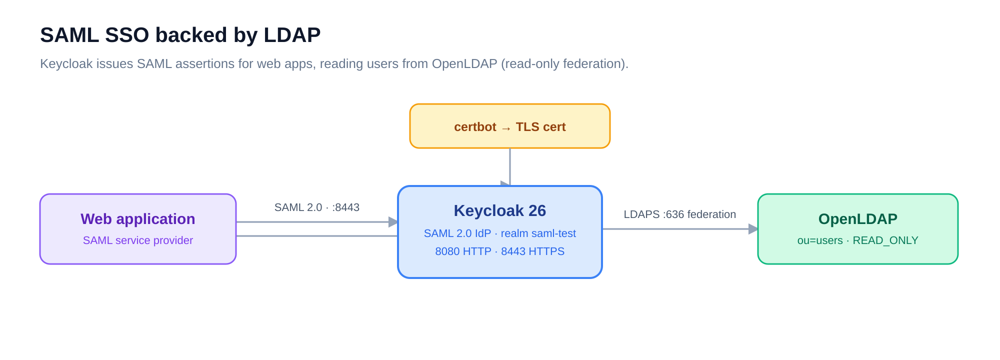

# keycloak — SAML identity provider

> Part of the [Enterprise Authentication Testing Platform](../README.md). The SSO front
> door: it turns the LDAP directory into a SAML 2.0 identity provider for web apps.

## What it is

A Keycloak server configured with a **`saml-test` realm** that **federates the `ldap`
directory read-only**. Web applications integrate with it as a standard SAML 2.0 service
provider; Keycloak authenticates users out of OpenLDAP and issues assertions. It does not
own users — the directory does.

## How it works



`make setup-realm` creates the realm and wires the LDAP federation: it connects to
`ldaps://openldap:636`, binds as the LDAP admin, and reads users from
`ou=users,<base-dn>` (`READ_ONLY`, with attribute mappers for email, name, groups, etc.).
The base DN is derived from `LDAP_DOMAIN` — `ldap.example.com` → `dc=ldap,dc=example,dc=com`.

## Quickstart

```bash
make init           # env → copy-certs → deploy → readiness check
make setup-realm    # create the saml-test realm + LDAP federation
```

> `make init` does **not** run `setup-realm` — run it as the second step. Requires the
> `certbot` and `ldap` services already running.

`make` targets: `env`, `copy-certs`, `deploy`, `setup-realm`, `test`, `test-ldap`,
`status`, `logs`, `logs-follow`, `restart`, `stop`, `clean`.

## Configuration

`.env` (from `.env.example`):

| Variable | Purpose |
|----------|---------|
| `KEYCLOAK_DOMAIN` | Keycloak hostname (used by `KC_HOSTNAME` and TLS) |
| `KEYCLOAK_ADMIN` / `KEYCLOAK_ADMIN_PASSWORD` | Admin console credentials |
| `LDAP_HOST` / `LDAP_PORT` | OpenLDAP container (`openldap` / `636`) |
| `LDAP_DOMAIN` | Domain → LDAP base DN |
| `LDAP_ADMIN_PASSWORD` | Bind password for `cn=admin,<base-dn>` |
| `CERTBOT_CERT_NAME` | Cert directory name to copy from certbot |

## Ports

| Port | Protocol | Purpose |
|------|----------|---------|
| 8080 | HTTP | Admin console, readiness checks |
| 8443 | HTTPS | SAML endpoints, secure admin |

## SAML endpoints

For SAML service providers (realm `saml-test`):

| Endpoint | URL |
|----------|-----|
| Metadata | `https://<domain>:8443/realms/saml-test/protocol/saml/descriptor` |
| SSO / SLO | `https://<domain>:8443/realms/saml-test/protocol/saml` |
| Admin console | `https://<domain>:8443/admin` |

The five LDAP test users (`test-user-01` … `05`) and their groups appear in the realm via
federation — see the [`ldap` README](../ldap/README.md).

## Certificates

`make copy-certs` pulls the cert out of the certbot container into `docker/certs/`, which
docker-compose **mounts read-only at runtime** (`/opt/keycloak/conf/certs`) — no image
rebuild. After a renewal, re-run `make copy-certs restart`. `CERTBOT_CERT_NAME` must match
certbot's live-directory name (default `ldap.example.com`).

## Files

- [`config/realm-export.json`](config/realm-export.json) — realm, groups, and roles
- [`scripts/setup-realm.sh`](scripts/setup-realm.sh) — realm creation + LDAP federation
- [`Makefile`](Makefile) · [`.env.example`](.env.example) · [`docker-compose.yml`](docker-compose.yml)
