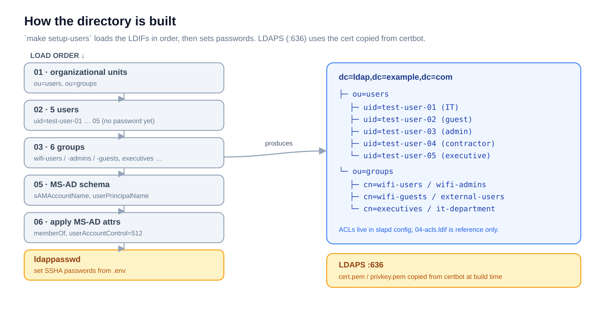

# ldap — OpenLDAP directory

> Part of the [Enterprise Authentication Testing Platform](../README.md). The directory of
> record: it holds the test users that FreeRADIUS and Keycloak authenticate against.

## What it is

An OpenLDAP server, pre-seeded with **five test users and six groups**, that speaks LDAP
(389) and LDAPS (636). It adds **Microsoft AD-compatible attributes** (`sAMAccountName`,
`userPrincipalName`, `userAccountControl`, `memberOf`) so it can stand in for Active
Directory when testing WiFi and SSO. Keycloak federates it for SAML; the same people exist
as RADIUS users in the `freeradius` project.

## How it works

`make setup-users` loads the LDIF files **in order**, then sets passwords — the directory
is built from these steps, not hand-edited. LDAPS uses the certificate copied from certbot
at build time.



The base DN is derived from `LDAP_DOMAIN` — `ldap.example.com` becomes
`dc=ldap,dc=example,dc=com`. (ACLs are configured in the slapd config; `04-acls.ldif` is
reference documentation, not loaded.)

## Quickstart

```bash
make init           # env → copy-certs → build-tls → deploy
make setup-users    # load the LDIFs, set passwords, apply MS-AD attributes
```

> Requires the `certbot` service to be running first (for the TLS certificate).

`make` targets: `env`, `copy-certs`, `build-tls`, `deploy`, `init`, `setup-users`,
`stop`, `logs`, `clean`, `backup` (exports the directory to LDIF via `slapcat`).

## Configuration

`.env` (from `.env.example`):

| Variable | Purpose |
|----------|---------|
| `LDAP_DOMAIN` | Domain → base DN (`ldap.example.com` → `dc=ldap,dc=example,dc=com`) |
| `LDAP_ORG` | Organization name in the directory |
| `LDAP_ADMIN_PASSWORD` | Password for `cn=admin,<base-dn>` |
| `LDAP_CONFIG_PASSWORD` | slapd `cn=config` password |
| `TEST_USER_PASSWORD` … `VIP_PASSWORD` | Per-user passwords for the five test users |

## Ports

| Port | Protocol | Use |
|------|----------|-----|
| 389 | LDAP | Plaintext — local testing |
| 636 | LDAPS | TLS — recommended |

## Test users

`uid=test-user-01` … `test-user-05` under `ou=users`:

| uid | Role | Group |
|-----|------|-------|
| `test-user-01` | IT employee | `wifi-users`, `it-department` |
| `test-user-02` | Guest | `wifi-guests` |
| `test-user-03` | Administrator | `wifi-admins`, `it-department` |
| `test-user-04` | Contractor | `external-users` |
| `test-user-05` | Executive | `executives` |

Check a bind once `setup-users` has run (substitute your base DN):

```bash
ldapsearch -x -H ldaps://localhost:636 \
  -D "uid=test-user-01,ou=users,dc=ldap,dc=example,dc=com" \
  -w "$TEST_USER_PASSWORD" -b "" -s base
```

## Files

- [`ldifs/`](ldifs/) — the directory contents, loaded in order (01 → 06)
- [`scripts/setup-users.sh`](scripts/setup-users.sh) — load LDIFs, set passwords, apply MS-AD attrs
- [`CLAUDE.md`](CLAUDE.md) — how to add users, groups, and attributes
- [`Makefile`](Makefile) · [`.env.example`](.env.example) · [`docker-compose.yml`](docker-compose.yml)
