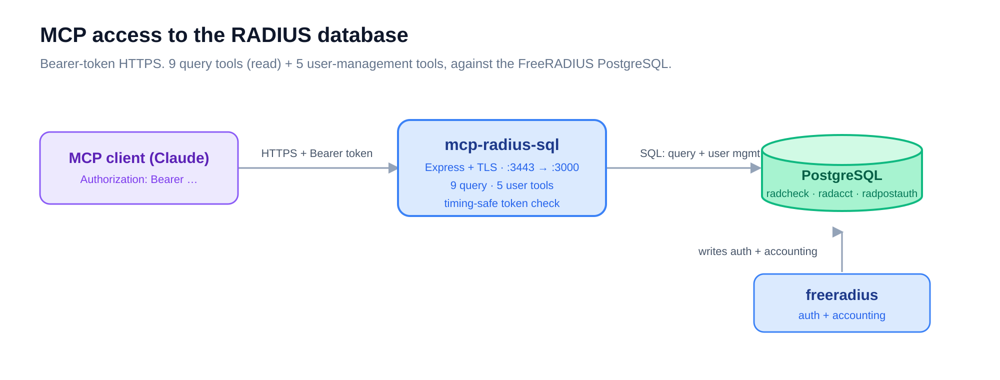

# mcp-radius-sql — RADIUS database over MCP

> Part of the [Enterprise Authentication Testing Platform](../README.md). The query and
> management layer: it exposes the FreeRADIUS database to an MCP client over HTTPS.

## What it is

An HTTPS [MCP](https://modelcontextprotocol.io) server over the FreeRADIUS PostgreSQL
database. Point Claude (or any MCP client) at it and ask, in plain language, "show me
failed logins in the last hour" or "create a RADIUS user." It offers **14 tools**: 9
read-only queries (auth, accounting, health) plus 5 user-management tools — `get`/`list`
read, while `create`/`update`/`delete` **write**, so this is not a read-only service. Every
request needs a bearer token; queries are parameterized.

## How it works



An Express + TLS server validates the bearer token (timing-safe) and serves the MCP
protocol; it reads — and, for user management, writes — the same PostgreSQL that
[`freeradius`](../freeradius/README.md) authenticates against.

## Quickstart

The server is built and deployed as part of the `freeradius` Docker stack:

```bash
make deploy           # copy certs → build → start (via ../freeradius/docker-compose.yml)
curl -k https://localhost:3443/health
```

Or run it directly with Node (≥ 18):

```bash
npm install && npm run build && npm start   # or: npm run dev
```

`make` targets: `copy-certs`, `build`, `deploy`, `stop`, `logs`, `status`.
npm scripts: `build` (tsc), `start`, `dev` (tsx), `test` (vitest), `test:watch`, `lint`.

## Configuration

`.env` (from `.env.example`):

| Variable | Required | Default | Purpose |
|----------|----------|---------|---------|
| `MCP_TOKEN` | **yes** | — | Bearer token (≥ 32 chars) |
| `HTTP_PORT` | no | `3000` | In-container port |
| `HTTPS_ENABLED` | no | `false` | Serve TLS (true in the compose deploy) |
| `TLS_CERT_FILE` / `TLS_KEY_FILE` | no | `/app/certs/fullchain.pem`, `privkey.pem` | TLS material |
| `POSTGRES_HOST` / `_DB` / `_USER` / `_PASSWORD` | **yes** | — | Database connection |
| `POSTGRES_PORT` | no | `5432` | Database port |
| `LOG_LEVEL` | no | `info` | `debug` / `info` / `warn` / `error` |

Port mapping in the deploy: **`3443` (host, HTTPS) → `3000` (container)**.

## HTTP endpoints

| Endpoint | Method | Auth | Purpose |
|----------|--------|------|---------|
| `/health` | GET | none | DB connectivity + latency |
| `/mcp` | POST | bearer | MCP requests |
| `/mcp` | GET | bearer | SSE notifications |
| `/mcp/sessions/:sessionId` | DELETE | bearer | Close a session |

## MCP tools (14)

**Query — authentication** · `radius_auth_recent`, `radius_failed_auth`, `radius_by_mac`,
`radius_by_user`
**Query — accounting** · `radius_acct_recent`, `radius_active_sessions`, `radius_by_nas`,
`radius_bandwidth_top`
**Health** · `radius_health`
**User management** · `radius_user_create`, `radius_user_get`, `radius_user_update`,
`radius_user_delete`, `radius_user_list` (`create`/`update`/`delete` modify the database)

## Connect from Claude Code

```json
{
  "mcpServers": {
    "radius-sql": {
      "url": "https://<host>:3443/mcp",
      "headers": { "Authorization": "Bearer <your-mcp-token>" }
    }
  }
}
```

Use the hostname that matches the certificate (not an IP) — Claude Code does not skip TLS
verification.

## Files

- [`src/tools/`](src/tools/) — the tool implementations (`auth`, `acct`, `users`) + Zod schemas
- [`src/auth/middleware.ts`](src/auth/middleware.ts) — bearer-token check · [`src/db/`](src/db/) — pool + health
- [`Dockerfile`](Dockerfile) · [`Makefile`](Makefile) · [`.env.example`](.env.example)
